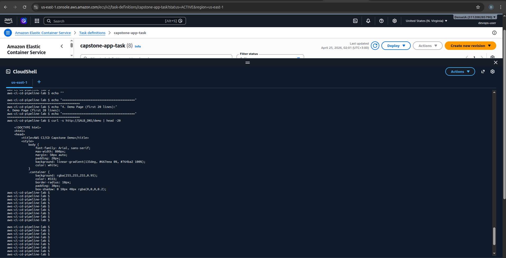

# AWS CI/CD Capstone Project: End-to-End Production Pipeline

[](https://aws.amazon.com)
[](https://aws.amazon.com/codepipeline/)
[](https://www.docker.com)
[](https://aws.amazon.com/ecs/)

---

## Table of Contents

1. [Project Overview](#1-project-overview)
2. [Architecture](#2-architecture)
3. [Repository Structure](#3-repository-structure)
4. [Prerequisites](#4-prerequisites)
5. [Step 1 — Prepare the Application](#step-1--prepare-the-application)
6. [Step 2 — Set Up Amazon ECR](#step-2--set-up-amazon-ecr)
7. [Step 3 — Create ECS Cluster & Service](#step-3--create-ecs-cluster--service)
8. [Step 4 — Configure CodeBuild](#step-4--configure-codebuild)
9. [Step 5 — Configure CodeDeploy](#step-5--configure-codedeploy)
10. [Step 6 — Create CodePipeline](#step-6--create-codepipeline)
11. [Step 7 — Monitoring & Alerts](#step-7--monitoring--alerts)
12. [Testing the Application](#testing-the-application)
13. [Configuration File Reference](#configuration-file-reference)
14. [Troubleshooting](#troubleshooting)
15. [Rubric Checklist](#rubric-checklist)

---

## 1. Project Overview

This project implements a **production-grade, fully automated CI/CD pipeline** on AWS. Every `git push` to the `main` branch automatically triggers:

1. **Source** — CodePipeline detects the change via GitHub webhook.
2. **Build** — CodeBuild installs dependencies, runs unit tests, builds a Docker image, and pushes it to ECR.
3. **Approval** — A manual gate must be approved before promoting to production.
4. **Deploy** — CodeDeploy performs a Blue/Green deployment to ECS Fargate behind an Application Load Balancer.
5. **Monitor** — CloudWatch alarms and SNS email notifications track pipeline and service health.

### Key Features

- Fully automated pipeline from `git push` to live deployment
- Docker containerization with multi-stage build
- Zero-downtime Blue/Green deployments via CodeDeploy
- Manual approval gate before every production deploy
- CloudWatch monitoring with SNS email alerts
- Health checks, rate limiting, and security headers

---

## 2. Architecture

```
GitHub (git push)
    │
    ▼
AWS CodePipeline
    │
    ├── Stage 1: SOURCE ─────── GitHub (webhook trigger)
    │
    ├── Stage 2: BUILD ──────── AWS CodeBuild
    │                               ├── npm install
    │                               ├── npm test (Jest)
    │                               ├── docker build
    │                               └── docker push → Amazon ECR
    │
    ├── Stage 3: APPROVAL ────── Manual approval (SNS email notification)
    │
    └── Stage 4: DEPLOY ──────── AWS CodeDeploy (Blue/Green)
                                     └── ECS Fargate Service
                                            └── Application Load Balancer
                                                   └── Users (port 80)

Monitoring: CloudWatch Alarms → SNS → Email Notifications
```

---

## 3. Repository Structure

```
capstone-project-2/
├── src/
│   ├── app.js                  # Express.js application (5 endpoints)
│   ├── package.json            # Dependencies and npm scripts
│   └── package-lock.json       # Locked dependency versions
├── tests/
│   ├── app.test.js             # Jest unit tests (all endpoints)
│   └── health.test.js          # Health check and response tests
├── images/                     # Deployment screenshots
├── Dockerfile                  # Multi-stage container build
├── buildspec.yml               # CodeBuild instructions
├── appspec.yml                 # CodeDeploy ECS deployment spec
├── taskdef.json                # ECS Task Definition template
└── README.md                   # This file
```

---

## 4. Prerequisites

| Requirement | Details |
|---|---|
| AWS Account | With permissions for CodePipeline, CodeBuild, CodeDeploy, ECS, ECR, IAM, CloudWatch |
| AWS CLI | Installed and configured (`aws configure`) |
| Docker | Installed locally for optional local testing |
| GitHub Account | Repository ready with your code |
| Node.js ≥ 16 | For local development |
| Git | Installed locally |

Verify your AWS CLI is working before starting:

```bash
aws sts get-caller-identity
```

---

## Step 1 — Prepare the Application

The application is a production-ready Express.js API with the following endpoints:

| Endpoint | Description |
|---|---|
| `GET /` | Welcome message with pipeline info |
| `GET /health` | Health check (used by ALB) |
| `GET /api/info` | Application metadata and architecture info |
| `GET /demo` | HTML demo page |
| `GET /metrics` | Node.js runtime metrics |

### Run locally

```bash
cd src
npm install
npm test       # Run all Jest tests
npm start      # Start on http://localhost:3000
```

### Run tests from the project root

```bash
# From capstone-project-2/
npx jest tests/ --coverage
```

### Build and run with Docker

```bash
# From project root
docker build -t capstone-app:local .
docker run -p 3000:3000 capstone-app:local

# Test it
curl http://localhost:3000/health
```

### Local test output


*Local project structure and file layout*


*Health endpoint returning `{"status":"healthy"}` locally*


*Root endpoint returning welcome message locally*

---

## Step 2 — Set Up Amazon ECR

Create the ECR repository where Docker images will be stored.

```bash
aws ecr create-repository \
  --repository-name capstone-ci-cd-app-repo \
  --region us-east-1
```

Note the `repositoryUri` from the output:

```
508471420037.dkr.ecr.us-east-1.amazonaws.com/capstone-ci-cd-app-repo
```

Verify the repository was created:

```bash
aws ecr describe-repositories --repository-names capstone-ci-cd-app-repo
```

---

## Step 3 — Create ECS Cluster & Service

### 3.1 Create the ECS Cluster

```bash
aws ecs create-cluster \
  --cluster-name capstone-cluster \
  --capacity-providers FARGATE \
  --region us-east-1
```

### 3.2 Create a Security Group for the ALB

```bash
# Create security group
aws ec2 create-security-group \
  --group-name capstone-alb-sg \
  --description "Security group for capstone ALB" \
  --vpc-id <YOUR_VPC_ID>

# Allow inbound HTTP on port 80
aws ec2 authorize-security-group-ingress \
  --group-id <ALB_SG_ID> \
  --protocol tcp \
  --port 80 \
  --cidr 0.0.0.0/0
```

### 3.3 Create the Application Load Balancer

```bash
# Create the ALB
aws elbv2 create-load-balancer \
  --name capstone-alb \
  --subnets <SUBNET_ID_1> <SUBNET_ID_2> \
  --security-groups <ALB_SG_ID> \
  --scheme internet-facing \
  --type application

# Create Blue target group
aws elbv2 create-target-group \
  --name capstone-tg \
  --protocol HTTP \
  --port 3000 \
  --vpc-id <YOUR_VPC_ID> \
  --target-type ip \
  --health-check-path /health

# Create Green target group (for Blue/Green deployments)
aws elbv2 create-target-group \
  --name capstone-tg-green \
  --protocol HTTP \
  --port 3000 \
  --vpc-id <YOUR_VPC_ID> \
  --target-type ip \
  --health-check-path /health

# Create listener on port 80
aws elbv2 create-listener \
  --load-balancer-arn <ALB_ARN> \
  --protocol HTTP \
  --port 80 \
  --default-actions Type=forward,TargetGroupArn=<BLUE_TG_ARN>
```

### 3.4 Register the ECS Task Definition

```bash
aws ecs register-task-definition \
  --cli-input-json file://taskdef.json \
  --region us-east-1
```

### 3.5 Create a Security Group for ECS Tasks

```bash
# Create security group for ECS tasks
aws ec2 create-security-group \
  --group-name capstone-ecs-sg \
  --description "Security group for capstone ECS tasks" \
  --vpc-id <YOUR_VPC_ID>

# Allow inbound on port 3000 from ALB only
aws ec2 authorize-security-group-ingress \
  --group-id <ECS_SG_ID> \
  --protocol tcp \
  --port 3000 \
  --source-group <ALB_SG_ID>
```

### 3.6 Create the ECS Service

> **Important:** Select **Blue/Green deployment (CodeDeploy)** — this cannot be changed after service creation.

In the AWS Console: **ECS → capstone-cluster → Create Service**

```
Launch type:      Fargate
Task definition:  capstone-app-task (latest)
Service name:     capstone-service
Desired tasks:    1
Subnets:          Select at least 2 public subnets
Security group:   capstone-ecs-sg
Load balancer:    capstone-alb
Target group:     capstone-tg (Blue)
Deployment type:  Blue/Green deployment
```

> Creating the service with Blue/Green automatically creates a CodeDeploy application and deployment group. Note the CodeDeploy application name from the ECS service page.

### Infrastructure Screenshots


*Application Load Balancer (capstone-alb) active and healthy*


*Target group configured for ECS Fargate tasks on port 3000*


*ECS service running with tasks in steady state*

---

## Step 4 — Configure CodeBuild

### buildspec.yml

The `buildspec.yml` at the project root instructs CodeBuild to:

1. Log in to ECR using the modern `get-login-password` command
2. Install npm dependencies inside `src/`
3. Run all Jest tests — **build fails if tests fail**
4. Build the Docker image and tag it with both `:latest` and the commit hash
5. Push both tags to ECR
6. Write `imagedefinitions.json` for CodePipeline to trigger the ECS deploy

### Create the CodeBuild Project

```bash
aws codebuild create-project \
  --name capstone-build \
  --source type=GITHUB,location=https://github.com/<YOUR_USERNAME>/capstone-project-2 \
  --artifacts type=NO_ARTIFACTS \
  --environment \
    type=LINUX_CONTAINER,\
    computeType=BUILD_GENERAL1_SMALL,\
    image=aws/codebuild/standard:7.0,\
    privilegedMode=true \
  --service-role arn:aws:iam::<ACCOUNT_ID>:role/codebuild-capstone-role \
  --region us-east-1
```

> **Privileged mode must be enabled** — Docker builds require it.

### Grant CodeBuild ECR Permissions

Attach this policy to the CodeBuild service role:

```json
{
  "Version": "2012-10-17",
  "Statement": [
    {
      "Effect": "Allow",
      "Action": [
        "ecr:GetAuthorizationToken",
        "ecr:BatchCheckLayerAvailability",
        "ecr:InitiateLayerUpload",
        "ecr:UploadLayerPart",
        "ecr:CompleteLayerUpload",
        "ecr:PutImage"
      ],
      "Resource": "*"
    }
  ]
}
```

```bash
aws iam put-role-policy \
  --role-name codebuild-capstone-role \
  --policy-name ECRPushPolicy \
  --policy-document file://ecr-policy.json
```

---

## Step 5 — Configure CodeDeploy

### 5.1 Verify the CodeDeploy application exists

Creating the ECS service with Blue/Green in Step 3.6 auto-creates a CodeDeploy application. Confirm:

```bash
aws deploy list-applications --region us-east-1
```

Expected output includes something like:
```
AppECS-capstone-cluster-capstone-service
```

### 5.2 If it wasn't auto-created, create it manually

```bash
aws deploy create-application \
  --application-name capstone-deploy \
  --compute-platform ECS \
  --region us-east-1
```

### 5.3 appspec.yml

The `appspec.yml` at the project root tells CodeDeploy which ECS task definition and load balancer to use. The `TaskDefinition` placeholder is replaced automatically by CodePipeline at deploy time.

### 5.4 taskdef.json

The `taskdef.json` defines the ECS task: container image, port mappings, CPU/memory, CloudWatch log group, and health check. The `<IMAGE_NAME>` placeholder is replaced by CodePipeline using `imagedefinitions.json` from the build stage.

---

## Step 6 — Create CodePipeline

### Create the pipeline via AWS Console

Go to **CodePipeline → Pipelines → Create pipeline**.

**Pipeline settings:**

```
Pipeline name:   capstone-pipeline
Service role:    Create new role (auto-created)
Artifact store:  Default S3 bucket
```

**Stage 1 — Source:**

```
Provider:      GitHub (Version 2)
Connection:    Create a new GitHub connection (OAuth)
Repository:    <your-username>/capstone-project-2
Branch:        main
Detection:     GitHub webhooks (automatic on push)
```

**Stage 2 — Build:**

```
Provider:      AWS CodeBuild
Project name:  capstone-build
Build type:    Single build
```

**Stage 3 — Approval:**

```
Stage name:    Approval
Action name:   ManualApproval
Provider:      Manual approval
SNS topic:     arn:aws:sns:us-east-1:<ACCOUNT_ID>:capstone-alerts
Comments:      Review build artifacts before deploying to production.
```

**Stage 4 — Deploy:**

```
Provider:              Amazon ECS (Blue/Green)
Application name:      AppECS-capstone-cluster-capstone-service
Deployment group:      DgpECS-capstone-cluster-capstone-service
Task definition:       BuildArtifact → taskdef.json
AppSpec file:          BuildArtifact → appspec.yml
Image placeholder:     <IMAGE_NAME> → BuildArtifact → imageDetail.json
```

Click **Create pipeline**. The pipeline will run immediately on creation.

---

## Step 7 — Monitoring & Alerts

### 7.1 Create SNS Topic for Alerts

```bash
# Create the topic
aws sns create-topic \
  --name capstone-alerts \
  --region us-east-1

# Subscribe your email
aws sns subscribe \
  --topic-arn arn:aws:sns:us-east-1:<ACCOUNT_ID>:capstone-alerts \
  --protocol email \
  --notification-endpoint your-email@example.com \
  --region us-east-1
```

Check your inbox and click **Confirm subscription**.

### 7.2 CloudWatch Alarm — ECS Running Task Count

Alerts when the number of running ECS tasks drops to 0:

```bash
aws cloudwatch put-metric-alarm \
  --alarm-name "capstone-ECS-NoRunningTasks" \
  --alarm-description "Alert when ECS running task count drops below 1" \
  --metric-name RunningTaskCount \
  --namespace AWS/ECS \
  --dimensions \
    Name=ClusterName,Value=capstone-cluster \
    Name=ServiceName,Value=capstone-service \
  --statistic Average \
  --period 60 \
  --evaluation-periods 1 \
  --threshold 1 \
  --comparison-operator LessThanThreshold \
  --alarm-actions arn:aws:sns:us-east-1:<ACCOUNT_ID>:capstone-alerts \
  --treat-missing-data breaching \
  --region us-east-1
```

### 7.3 CloudWatch Alarm — CodePipeline Failures

Alerts when any pipeline execution fails:

```bash
aws cloudwatch put-metric-alarm \
  --alarm-name "capstone-Pipeline-Failed" \
  --alarm-description "Alert when CodePipeline execution fails" \
  --metric-name FailedPipelineExecutions \
  --namespace AWS/CodePipeline \
  --dimensions Name=PipelineName,Value=capstone-pipeline \
  --statistic Sum \
  --period 60 \
  --evaluation-periods 1 \
  --threshold 1 \
  --comparison-operator GreaterThanOrEqualToThreshold \
  --alarm-actions arn:aws:sns:us-east-1:<ACCOUNT_ID>:capstone-alerts \
  --treat-missing-data notBreaching \
  --region us-east-1
```

### 7.4 Verify Monitoring is Active

```bash
# List alarms and check state
aws cloudwatch describe-alarms \
  --alarm-names "capstone-ECS-NoRunningTasks" "capstone-Pipeline-Failed" \
  --query 'MetricAlarms[*].{Name:AlarmName,State:StateValue}' \
  --output table
```

Both alarms should show `OK` state.

### Monitoring Screenshots


*CloudWatch monitoring dashboard showing ECS and pipeline health metrics*


*SNS subscription confirmation email received and confirmed*


*Test notification from CloudWatch alarm demonstrating working alerts*

---

## Testing the Application

### Live Endpoints (deployed on ECS)

| Endpoint | URL |
|---|---|
| Root | http://capstone-alb-2089285546.us-east-1.elb.amazonaws.com/ |
| Health | http://capstone-alb-2089285546.us-east-1.elb.amazonaws.com/health |
| API Info | http://capstone-alb-2089285546.us-east-1.elb.amazonaws.com/api/info |
| Demo | http://capstone-alb-2089285546.us-east-1.elb.amazonaws.com/demo |

### Verify via AWS CLI

```bash
ALB="http://capstone-alb-2089285546.us-east-1.elb.amazonaws.com"

# Test all endpoints
curl -s $ALB/         | jq .status
curl -s $ALB/health   | jq .status
curl -s $ALB/api/info | jq .appName
```

### Verify ECS, ECR, and monitoring in one shot

```bash
# ECS service status
aws ecs describe-services \
  --cluster capstone-cluster \
  --services capstone-service \
  --query 'services[0].{Status:status,Running:runningCount,Desired:desiredCount}' \
  --output table

# Latest ECR image
aws ecr describe-images \
  --repository-name capstone-ci-cd-app-repo \
  --query 'sort_by(imageDetails,&imagePushedAt)[-1].{Tag:imageTags[0],Pushed:imagePushedAt}' \
  --output table

# SNS subscription status
aws sns list-subscriptions-by-topic \
  --topic-arn arn:aws:sns:us-east-1:<ACCOUNT_ID>:capstone-alerts \
  --query 'Subscriptions[*].{Protocol:Protocol,Status:SubscriptionArn}' \
  --output table
```

### Application Screenshots (AWS Deployment)


*Root endpoint returning welcome message and pipeline info*


*Health check endpoint showing `healthy` status and version 2.0.0*


*API info endpoint showing application metadata and architecture*


*HTML demo page served from ECS Fargate behind the ALB*

### CLI Verification Screenshots


*AWS CLI verifying root and health endpoint responses*


*AWS CLI displaying demo page HTML output*


*Complete CLI report showing ECS service, ECR image, CloudWatch alarms, and SNS topic*

---

## Configuration File Reference

### buildspec.yml

| Phase | What it does |
|---|---|
| `pre_build` | Logs in to ECR using `get-login-password`, sets image URI and tag variables |
| `build` | Installs npm deps in `src/`, runs Jest tests, builds Docker image |
| `post_build` | Pushes both `:latest` and commit-hash tags to ECR, writes `imagedefinitions.json` |
| `artifacts` | Exports `imagedefinitions.json` for the CodePipeline deploy stage |

### appspec.yml

| Field | Purpose |
|---|---|
| `TaskDefinition` | Replaced at deploy time by CodePipeline with the new task definition ARN |
| `ContainerName` | Must exactly match the container name in `taskdef.json` — `capstone-container` |
| `ContainerPort` | Port the app listens on — `3000` |

### taskdef.json — Placeholders

| Placeholder | Replaced with |
|---|---|
| `<IMAGE_NAME>` | ECR image URI — managed dynamically by CodePipeline |
| Account ID | Your 12-digit AWS account ID (`508471420037`) |

---

## IAM Permissions Reference

| Role | Permissions needed |
|---|---|
| CodeBuild service role | ECR push, S3 read/write, CloudWatch Logs, SSM read |
| CodeDeploy service role | ECS full access, ELB read/write, S3 read |
| CodePipeline service role | CodeBuild start, CodeDeploy deploy, S3, SNS, ECS |
| ECS Task Execution role | ECR pull, CloudWatch Logs write |

---

## Troubleshooting

| Problem | Likely Cause | Fix |
|---|---|---|
| `Cannot connect to Docker daemon` | Privileged mode not enabled in CodeBuild | Edit build project → enable **Privileged** mode |
| ECR login fails | Old `get-login` command used | `buildspec.yml` uses `get-login-password` — verify this |
| Tests fail in CodeBuild | `supertest` not installed or wrong path | Ensure `npm install` runs in `src/` and tests reference `../src/app` |
| CodeDeploy group missing | ECS service not created with Blue/Green type | Recreate the ECS service with Blue/Green deployment type selected |
| ALB returns `502` | Container not reachable on port 3000 | Check ECS security group allows inbound 3000 from ALB security group |
| ECS tasks keep stopping | App crashes on startup | Check CloudWatch Logs at `/ecs/capstone-app` for error output |
| Pipeline not triggering on push | GitHub connection not authorized | Go to **CodePipeline → Settings → Connections** and verify the GitHub connection is Active |
| Approval email not received | SNS subscription not confirmed | Check your email spam folder and confirm the SNS subscription link |

---

## Rubric Checklist

### Application, Repository & Containerization (25 pts)

- [x] `src/app.js` — Express app with multiple routes including `/` and `/health`
- [x] `src/package.json` — dependencies and test script defined
- [x] `tests/app.test.js` — Jest unit tests covering all endpoints
- [x] `tests/health.test.js` — additional health and response time tests
- [x] `Dockerfile` — app builds and runs in a container
- [x] `README.md` — complete setup guide with screenshots

### CI/CD Pipeline Implementation (25 pts)

- [x] `buildspec.yml` — installs deps, runs tests, builds Docker image, pushes to ECR
- [x] `imagedefinitions.json` — generated and exported as pipeline artifact
- [x] CodeBuild project — tests must pass before image is built
- [x] CodePipeline — Source → Build stages connected and passing
- [x] ECR repository — images visible after successful build (`:latest` + commit hash tag)

### Deployment & Infrastructure (30 pts)

- [x] ECS cluster (`capstone-cluster`) created with Fargate
- [x] ECS service (`capstone-service`) running at least 1 task
- [x] Application Load Balancer serving traffic on port 80
- [x] `appspec.yml` and `taskdef.json` present and correctly configured
- [x] CodeDeploy Blue/Green deployment configured
- [x] Pipeline Deploy stage triggers ECS Blue/Green update via CodeDeploy
- [x] App accessible via ALB DNS name in browser

### Monitoring, Governance & Documentation (20 pts)

- [x] CloudWatch alarm for ECS running task count
- [x] CloudWatch alarm for CodePipeline failures
- [x] SNS topic with confirmed email subscription
- [x] Manual Approval stage present in pipeline before Deploy
- [x] `README.md` covers all setup steps with CLI commands
- [ ] `pipeline-diagram.png` — add architecture diagram to repository root

---

*Every `git push` to `main` automatically builds, tests, and deploys the application through the full CI/CD pipeline.*ce identifiers here:

```
ECR Repository URI : <account_id>.dkr.ecr.<region>.amazonaws.com/capstone-project2-repo
ECS Cluster Name   : capstone-project2-cluster
ECS Service Name   : capstone-project2-service
ALB DNS Name       : capstone-project2-alb-<id>.<region>.elb.amazonaws.com
CodePipeline Name  : capstone-project2-pipeline
SNS Topic ARN      : arn:aws:sns:<region>:<account_id>:capstone-project2-alerts
```

Visit the ALB DNS name in your browser — you should see:

```
Hello from AWS CI/CD Capstone Project!
```

---

*Built for the AWS CI/CD Capstone Project. Every `git push` to `main` automatically builds, tests, and deploys your application.*