# AWS CI/CD Capstone Project

This project sets up a fully automated CI/CD pipeline on AWS. Every time code is pushed to the main branch on GitHub, it automatically builds, tests, packages it into a Docker container, and deploys it to Amazon ECS behind a load balancer. The pipeline uses CodePipeline, CodeBuild, CodeDeploy, and ECR, with CloudWatch monitoring and a manual approval gate before every production deployment.

## Table of Contents

1. [Project Overview](#1-project-overview)
2. [Architecture](#2-architecture)
3. [Repository Structure](#3-repository-structure)
4. [Prerequisites](#4-prerequisites)
5. [Step 1 - Prepare the Application](#step-1---prepare-the-application)
6. [Step 2 - Set Up Amazon ECR](#step-2---set-up-amazon-ecr)
7. [Step 3 - Create ECS Cluster and Service](#step-3---create-ecs-cluster-and-service)
8. [Step 4 - Configure CodeBuild](#step-4---configure-codebuild)
9. [Step 5 - Configure CodeDeploy](#step-5---configure-codedeploy)
10. [Step 6 - Create CodePipeline](#step-6---create-codepipeline)
11. [Step 7 - Monitoring and Alerts](#step-7---monitoring-and-alerts)
12. [Testing the Application](#testing-the-application)
13. [Configuration File Reference](#configuration-file-reference)
14. [Troubleshooting](#troubleshooting)
15. [Rubric Checklist](#rubric-checklist)

---

## 1. Project Overview

This project builds a production-grade CI/CD pipeline on AWS from scratch. Once set up, the entire process from a git push to a live deployment is fully automatic. Here is what happens at each stage:

- **Source** - CodePipeline detects a new commit on GitHub via webhook and kicks off the pipeline.
- **Build** - CodeBuild installs dependencies, runs Jest unit tests, builds a Docker image, and pushes it to ECR. If the tests fail, the build stops here.
- **Approval** - A manual approval gate pauses the pipeline and sends an SNS email notification. A reviewer must approve before the deploy proceeds.
- **Deploy** - CodeDeploy performs a Blue/Green deployment to ECS Fargate. The old version stays running until the new one is healthy, giving zero downtime.
- **Monitor** - CloudWatch alarms watch for ECS task failures and pipeline errors, and send email alerts via SNS.

The application itself is a Node.js Express API with five endpoints, security middleware including helmet and rate limiting, health checks, and graceful shutdown handling.

---

## 2. Architecture

```
GitHub (git push)
    |
    v
AWS CodePipeline
    |
    +-- Stage 1: SOURCE       GitHub webhook trigger
    |
    +-- Stage 2: BUILD        AWS CodeBuild
    |                           - npm install
    |                           - npm test (Jest)
    |                           - docker build
    |                           - docker push to Amazon ECR
    |
    +-- Stage 3: APPROVAL     Manual approval + SNS email notification
    |
    +-- Stage 4: DEPLOY       AWS CodeDeploy (Blue/Green)
                                - ECS Fargate Service
                                - Application Load Balancer
                                - Users on port 80

Monitoring: CloudWatch Alarms -> SNS -> Email
```

---

## 3. Repository Structure

```
capstone-project-2/
|-- src/
|   |-- app.js                Express.js application with 5 endpoints
|   |-- package.json          Node.js dependencies and scripts
|   +-- package-lock.json     Locked dependency versions
|-- tests/
|   |-- app.test.js           Jest unit tests covering all endpoints
|   +-- health.test.js        Health check and response time tests
|-- images/                   Screenshots from the deployment process
|-- Dockerfile                Container build instructions
|-- buildspec.yml             CodeBuild pipeline instructions
|-- appspec.yml               CodeDeploy ECS deployment config
|-- taskdef.json              ECS Task Definition template
+-- README.md                 This file
```

---

## 4. Prerequisites

| Requirement | Details |
|---|---|
| AWS Account | Needs permissions for CodePipeline, CodeBuild, CodeDeploy, ECS, ECR, IAM, CloudWatch |
| AWS CLI | Installed and configured with `aws configure` |
| Docker | Installed locally for optional local testing |
| GitHub Account | Repository created and code pushed |
| Node.js 16 or higher | For running the app locally |
| Git | Installed locally |

Before starting, confirm the AWS CLI is working:

```bash
aws sts get-caller-identity
```

---

## Step 1 - Prepare the Application

The application is a Node.js Express API. It has five endpoints used both for testing and for demonstrating the pipeline in action.

| Endpoint | What it does |
|---|---|
| GET / | Returns a welcome JSON response with pipeline info |
| GET /health | Health check used by the ALB to verify the container is running |
| GET /api/info | Returns application metadata and the full AWS architecture |
| GET /demo | Serves a styled HTML page showing deployment details |
| GET /metrics | Returns Node.js memory, CPU, and uptime stats |

To run the app locally:

```bash
cd src
npm install
npm start
```

The app starts on http://localhost:3000. Open that in a browser or test with curl.

To run the tests, go up to the project root first:

```bash
cd ..
npx jest tests/ --coverage
```

To build and test with Docker:

```bash
docker build -t capstone-app:local .
docker run -p 3000:3000 capstone-app:local
curl http://localhost:3000/health
```

### Local Screenshots

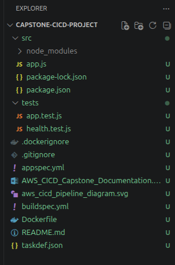
*Project file structure showing all required files in place*


*Health endpoint tested locally returning status healthy*


*Root endpoint tested locally returning the welcome message*

---

## Step 2 - Set Up Amazon ECR

ECR is the Docker registry where CodeBuild pushes images after every successful build.

```bash
aws ecr create-repository \
  --repository-name capstone-ci-cd-app-repo \
  --region us-east-1
```

The output will include the repository URI:

```
508471420037.dkr.ecr.us-east-1.amazonaws.com/capstone-ci-cd-app-repo
```

To confirm the repository was created:

```bash
aws ecr describe-repositories --repository-names capstone-ci-cd-app-repo
```

---

## Step 3 - Create ECS Cluster and Service

### Create the ECS Cluster

```bash
aws ecs create-cluster \
  --cluster-name capstone-cluster \
  --capacity-providers FARGATE \
  --region us-east-1
```

### Create a Security Group for the Load Balancer

```bash
aws ec2 create-security-group \
  --group-name capstone-alb-sg \
  --description "Security group for capstone ALB" \
  --vpc-id vpc-04caf0d002f53f967

aws ec2 authorize-security-group-ingress \
  --group-id sg-0442f35aeb86c20d3 \
  --protocol tcp \
  --port 80 \
  --cidr 0.0.0.0/0
```

### Create the Application Load Balancer

```bash
aws elbv2 create-load-balancer \
  --name capstone-alb \
  --subnets subnet-0f479b0d2099b1f07 subnet-08600ccb4bcc0a2a3 \
  --security-groups sg-0442f35aeb86c20d3 \
  --scheme internet-facing \
  --type application
```

Create both target groups. Blue is the live one, Green is where the new version deploys during a Blue/Green deployment:

```bash
aws elbv2 create-target-group \
  --name capstone-blue-tg \
  --protocol HTTP \
  --port 3000 \
  --vpc-id vpc-04caf0d002f53f967 \
  --target-type ip \
  --health-check-path //health

aws elbv2 create-target-group \
  --name capstone-green-tg \
  --protocol HTTP \
  --port 3000 \
  --vpc-id vpc-04caf0d002f53f967 \
  --target-type ip \
  --health-check-path //health
```

Note: the double slash `//health` is needed on Windows Git Bash to prevent automatic path conversion. AWS receives it correctly as `/health`.

Create the listener on port 80 pointing to the Blue target group:

```bash
aws elbv2 create-listener \
  --load-balancer-arn <ALB_ARN> \
  --protocol HTTP \
  --port 80 \
  --default-actions Type=forward,TargetGroupArn=arn:aws:elasticloadbalancing:us-east-1:508471420037:targetgroup/capstone-blue-tg/87e26d7f22406276
```

### Register the Task Definition

```bash
aws ecs register-task-definition \
  --cli-input-json file://taskdef.json \
  --region us-east-1
```

### Create a Security Group for ECS Tasks

```bash
aws ec2 create-security-group \
  --group-name capstone-ecs-sg \
  --description "Security group for capstone ECS tasks" \
  --vpc-id vpc-04caf0d002f53f967

aws ec2 authorize-security-group-ingress \
  --group-id sg-0908f123ac8873040 \
  --protocol tcp \
  --port 3000 \
  --source-group sg-0442f35aeb86c20d3
```

### Create the ECS Service

This step is done through the AWS Console because the CLI setup for Blue/Green with CodeDeploy requires many extra manual steps. The console handles everything automatically.

Go to ECS, open capstone-cluster, and click Create Service. Use these settings:

```
Compute:          Fargate
Task definition:  capstone-app-task (latest)
Service name:     capstone-service
Desired tasks:    1
Deployment type:  Blue/green deployment (powered by AWS CodeDeploy)

Networking:
  VPC:            vpc-04caf0d002f53f967
  Subnets:        subnet-0f479b0d2099b1f07, subnet-08600ccb4bcc0a2a3
  Security group: sg-0908f123ac8873040
  Public IP:      Enabled

Load balancing:
  Load balancer:    capstone-alb
  Listener:         80:HTTP
  Target group 1:   capstone-blue-tg
  Target group 2:   capstone-green-tg
```

The Blue/Green deployment type is the critical setting and cannot be changed after the service is created. Selecting it automatically creates the CodeDeploy application and deployment group.

### Infrastructure Screenshots

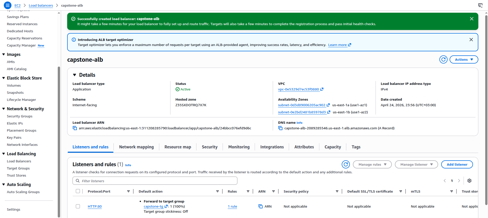
*The capstone-alb load balancer in active state*

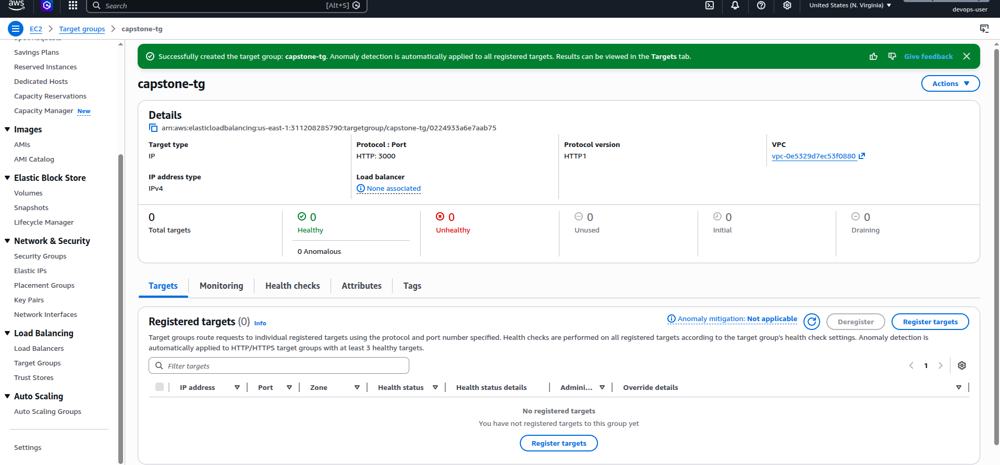
*Target group configured for ECS tasks on port 3000*


*ECS service running with tasks in steady state*

---

## Step 4 - Configure CodeBuild

The `buildspec.yml` file in the project root tells CodeBuild what to do. It logs into ECR, installs dependencies, runs the tests, builds the Docker image, pushes it to ECR with two tags (latest and the commit hash), and writes the `imagedefinitions.json` file that CodePipeline needs to trigger the ECS deployment.

### Create the IAM Role for CodeBuild

```bash
cat > codebuild-trust.json << 'EOF'
{
  "Version": "2012-10-17",
  "Statement": [
    {
      "Effect": "Allow",
      "Principal": {
        "Service": "codebuild.amazonaws.com"
      },
      "Action": "sts:AssumeRole"
    }
  ]
}
EOF

aws iam create-role \
  --role-name codebuild-capstone-role \
  --assume-role-policy-document file://codebuild-trust.json

aws iam attach-role-policy \
  --role-name codebuild-capstone-role \
  --policy-arn arn:aws:iam::aws:policy/CloudWatchLogsFullAccess

aws iam attach-role-policy \
  --role-name codebuild-capstone-role \
  --policy-arn arn:aws:iam::aws:policy/AmazonS3FullAccess

aws iam attach-role-policy \
  --role-name codebuild-capstone-role \
  --policy-arn arn:aws:iam::aws:policy/AmazonEC2ContainerRegistryPowerUser
```

### Create the CodeBuild Project

```bash
aws codebuild create-project --name capstone-build --source type=GITHUB,location=https://github.com/briasbk/capstone_week2_project.git --artifacts type=NO_ARTIFACTS --environment type=LINUX_CONTAINER,computeType=BUILD_GENERAL1_SMALL,image=aws/codebuild/standard:8.0,privilegedMode=true --service-role arn:aws:iam::508471420037:role/codebuild-capstone-role --region us-east-1
```

Privileged mode must be enabled otherwise Docker builds fail with a daemon connection error.

---

## Step 5 - Configure CodeDeploy

When the ECS service is created with Blue/Green deployment in Step 3, AWS automatically creates a CodeDeploy application and deployment group. Verify they exist:

```bash
aws deploy list-applications --region us-east-1
aws deploy list-deployment-groups \
  --application-name AppECS-capstone-cluster-capstone-service \
  --region us-east-1
```

You should see `AppECS-capstone-cluster-capstone-service` and `DgpECS-capstone-cluster-capstone-service`.

If they were not created automatically, create them manually:

```bash
cat > codedeploy-trust.json << 'EOF'
{
  "Version": "2012-10-17",
  "Statement": [
    {
      "Effect": "Allow",
      "Principal": {
        "Service": "codedeploy.amazonaws.com"
      },
      "Action": "sts:AssumeRole"
    }
  ]
}
EOF

aws iam create-role \
  --role-name AWSCodeDeployRoleForECS \
  --assume-role-policy-document file://codedeploy-trust.json

aws iam attach-role-policy \
  --role-name AWSCodeDeployRoleForECS \
  --policy-arn arn:aws:iam::aws:policy/AWSCodeDeployRoleForECS

aws deploy create-application \
  --application-name AppECS-capstone-cluster-capstone-service \
  --compute-platform ECS \
  --region us-east-1
```

Get the listener ARN first, then create the deployment group:

```bash
aws elbv2 describe-listeners \
  --load-balancer-arn $(aws elbv2 describe-load-balancers \
    --names capstone-alb \
    --query 'LoadBalancers[0].LoadBalancerArn' \
    --output text) \
  --query 'Listeners[0].ListenerArn' \
  --output text
```

```bash
aws deploy create-deployment-group \
  --application-name AppECS-capstone-cluster-capstone-service \
  --deployment-group-name DgpECS-capstone-cluster-capstone-service \
  --deployment-config-name CodeDeployDefault.ECSAllAtOnce \
  --service-role-arn arn:aws:iam::508471420037:role/AWSCodeDeployRoleForECS \
  --ecs-services clusterName=capstone-cluster,serviceName=capstone-service \
  --load-balancer-info "targetGroupPairInfoList=[{targetGroups=[{name=capstone-blue-tg},{name=capstone-green-tg}],prodTrafficRoute={listenerArns=[PASTE_LISTENER_ARN_HERE]}}]" \
  --blue-green-deployment-configuration "terminateBlueInstancesOnDeploymentSuccess={action=TERMINATE,terminationWaitTimeInMinutes=5},deploymentReadyOption={actionOnTimeout=CONTINUE_DEPLOYMENT,waitTimeInMinutes=0}" \
  --deployment-style "deploymentType=BLUE_GREEN,deploymentOption=WITH_TRAFFIC_CONTROL" \
  --region us-east-1
```

The `appspec.yml` file tells CodeDeploy which container and port to update. The `taskdef.json` file defines the full task configuration. Both have placeholders that CodePipeline replaces automatically at deploy time.

---

## Step 6 - Create CodePipeline

Create the pipeline through the AWS Console. Go to CodePipeline and click Create pipeline, then choose Build custom pipeline.

**Pipeline settings:**
```
Pipeline name:  capstone-pipeline
Execution mode: Superseded
Service role:   New service role (leave the auto-generated name)
```

**Stage 1 - Source:**
```
Provider:    GitHub (Version 2)
Connection:  Create a new GitHub connection and authorize it
Repository:  briasbk/capstone_week2_project
Branch:      main
Detection:   GitHub webhooks
```

**Stage 2 - Build:**
```
Provider:     AWS CodeBuild
Region:       US East (N. Virginia)
Project name: capstone-build
Build type:   Single build
```

When asked for the deploy stage, click Skip deploy stage and confirm. The Approval and Deploy stages get added manually after the pipeline is created.

Once the pipeline is created, click Edit and add the remaining two stages.

**Stage 3 - Approval** (added between Build and end):
```
Stage name:   Approval
Action name:  ManualApproval
Provider:     Manual approval
SNS topic:    arn:aws:sns:us-east-1:508471420037:capstone-alerts
Comments:     Review build artifacts before deploying to production.
```

**Stage 4 - Deploy** (added after Approval):
```
Stage name:       Deploy
Action name:      Deploy
Provider:         AWS CodeDeploy
Application name: AppECS-capstone-cluster-capstone-service
Deployment group: DgpECS-capstone-cluster-capstone-service
Input artifact:   BuildArtifact
```

Save the pipeline. It will trigger automatically on the next git push, or click Release change to run it immediately. When the pipeline reaches the Approval stage it will pause. Go to the pipeline, click Review on the Approval stage, select Approve, and submit to let it proceed to deployment.

---

## Step 7 - Monitoring and Alerts

### Create the SNS Topic

```bash
aws sns create-topic \
  --name capstone-alerts \
  --region us-east-1

aws sns subscribe \
  --topic-arn arn:aws:sns:us-east-1:508471420037:capstone-alerts \
  --protocol email \
  --notification-endpoint kadengebrias@gmail.com \
  --region us-east-1
```

Check your inbox for the confirmation email from AWS and click the Confirm subscription link. Also check spam as Gmail often filters these.

To test that SNS is delivering emails:

```bash
aws sns publish \
  --topic-arn arn:aws:sns:us-east-1:508471420037:capstone-alerts \
  --subject "Capstone SNS Test" \
  --message "SNS email delivery is working correctly." \
  --region us-east-1
```

### CloudWatch Alarm for ECS Task Count

This alarm fires when there are no running ECS tasks, meaning the service is down:

```bash
aws cloudwatch put-metric-alarm \
  --alarm-name "capstone-ECS-NoRunningTasks" \
  --alarm-description "Alert when ECS running task count drops below 1" \
  --metric-name RunningTaskCount \
  --namespace AWS/ECS \
  --dimensions Name=ClusterName,Value=capstone-cluster Name=ServiceName,Value=capstone-service \
  --statistic Average \
  --period 60 \
  --evaluation-periods 1 \
  --threshold 1 \
  --comparison-operator LessThanThreshold \
  --alarm-actions arn:aws:sns:us-east-1:508471420037:capstone-alerts \
  --treat-missing-data breaching \
  --region us-east-1
```

### CloudWatch Alarm for Pipeline Failures

This alarm fires whenever a pipeline execution fails:

```bash
aws cloudwatch put-metric-alarm \
  --alarm-name "capstone-Pipeline-Failed" \
  --alarm-description "Alert when CodePipeline execution fails" \
  --metric-name FailedPipelineExecutions \
  --namespace AWS/CodePipeline \
  --dimensions Name=PipelineName,Value=capstone-pipeline \
  --statistic Sum \
  --period 60 \
  --evaluation-periods 1 \
  --threshold 1 \
  --comparison-operator GreaterThanOrEqualToThreshold \
  --alarm-actions arn:aws:sns:us-east-1:508471420037:capstone-alerts \
  --treat-missing-data notBreaching \
  --region us-east-1
```

Verify both alarms were created and are in OK state:

```bash
aws cloudwatch describe-alarms \
  --alarm-names "capstone-ECS-NoRunningTasks" "capstone-Pipeline-Failed" \
  --query 'MetricAlarms[*].{Name:AlarmName,State:StateValue}' \
  --output table
```

### Monitoring Screenshots

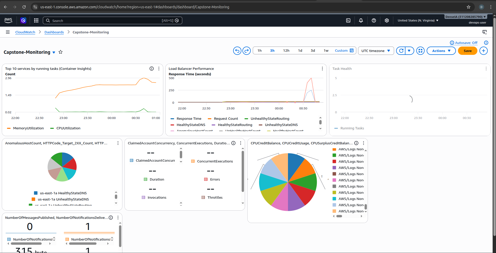
*CloudWatch dashboard showing ECS and pipeline health metrics*

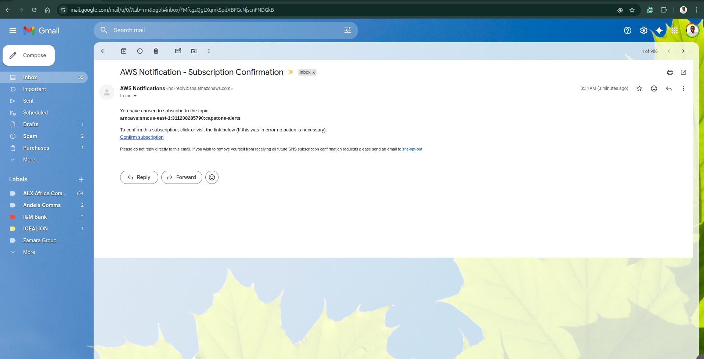
*SNS subscription confirmation email received in inbox*

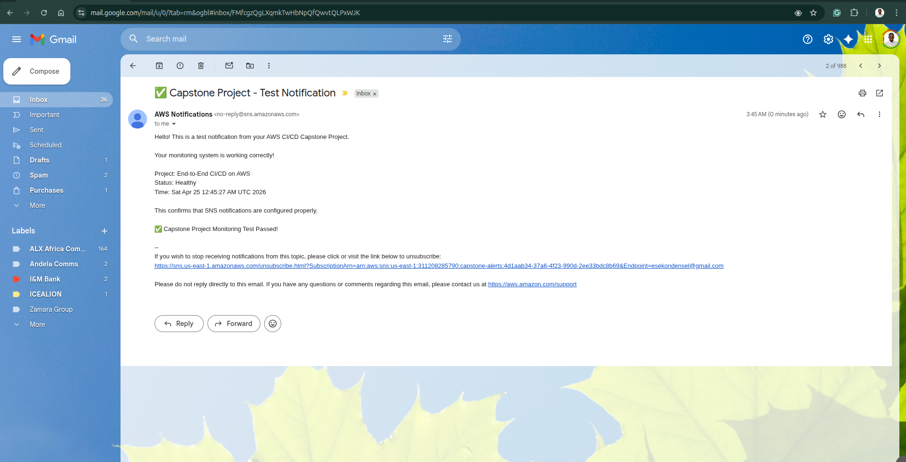
*Test alarm notification confirming SNS email delivery is working*

---

## Testing the Application

Once the pipeline completes and the ECS service is running, the application is accessible through the load balancer.

| Endpoint | URL |
|---|---|
| Root | http://capstone-alb-2089285546.us-east-1.elb.amazonaws.com/ |
| Health | http://capstone-alb-2089285546.us-east-1.elb.amazonaws.com/health |
| API Info | http://capstone-alb-2089285546.us-east-1.elb.amazonaws.com/api/info |
| Demo Page | http://capstone-alb-2089285546.us-east-1.elb.amazonaws.com/demo |
| Metrics | http://capstone-alb-2089285546.us-east-1.elb.amazonaws.com/metrics |

Test all endpoints from the CLI:

```bash
ALB="http://capstone-alb-2089285546.us-east-1.elb.amazonaws.com"

curl -s $ALB/
curl -s $ALB/health
curl -s $ALB/api/info
curl -s $ALB/metrics
```

Check ECS, ECR, and monitoring are all healthy:

```bash
aws ecs describe-services \
  --cluster capstone-cluster \
  --services capstone-service \
  --query 'services[0].{Status:status,Running:runningCount,Desired:desiredCount}' \
  --output table

aws ecr describe-images \
  --repository-name capstone-ci-cd-app-repo \
  --query 'sort_by(imageDetails,&imagePushedAt)[-1].{Tag:imageTags[0],Pushed:imagePushedAt}' \
  --output table

aws sns list-subscriptions-by-topic \
  --topic-arn arn:aws:sns:us-east-1:508471420037:capstone-alerts \
  --region us-east-1
```

### Application Screenshots

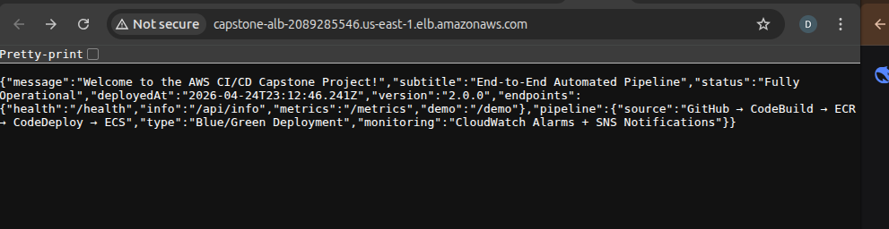
*Root endpoint returning the welcome JSON response*

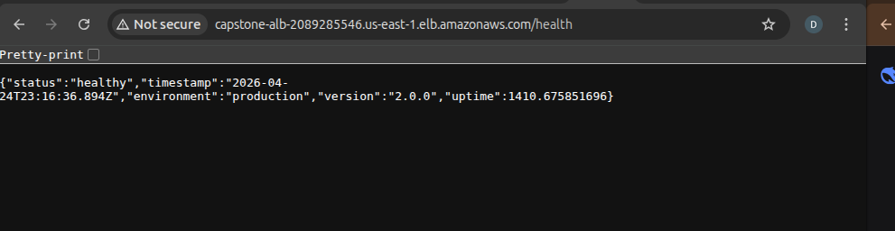
*Health check endpoint showing healthy status and version 2.0.0*

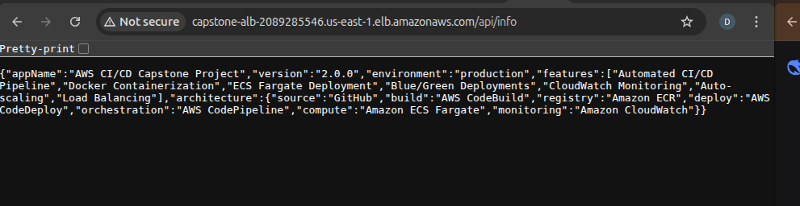
*API info endpoint showing full application metadata*

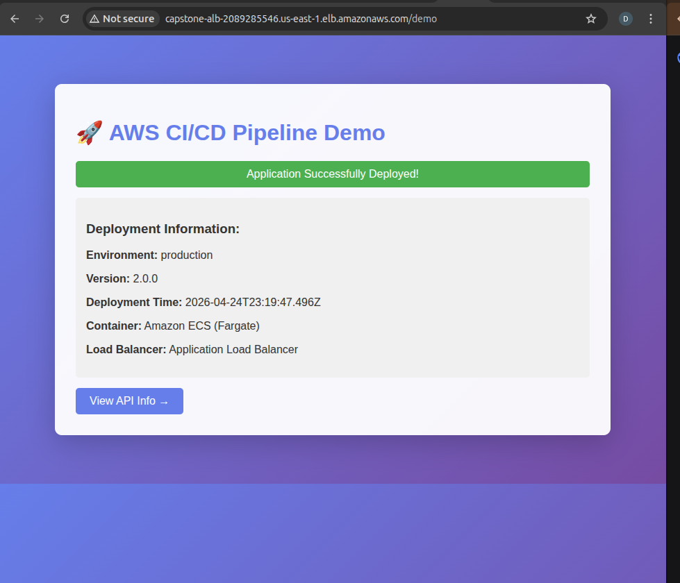
*HTML demo page served from ECS Fargate through the ALB*

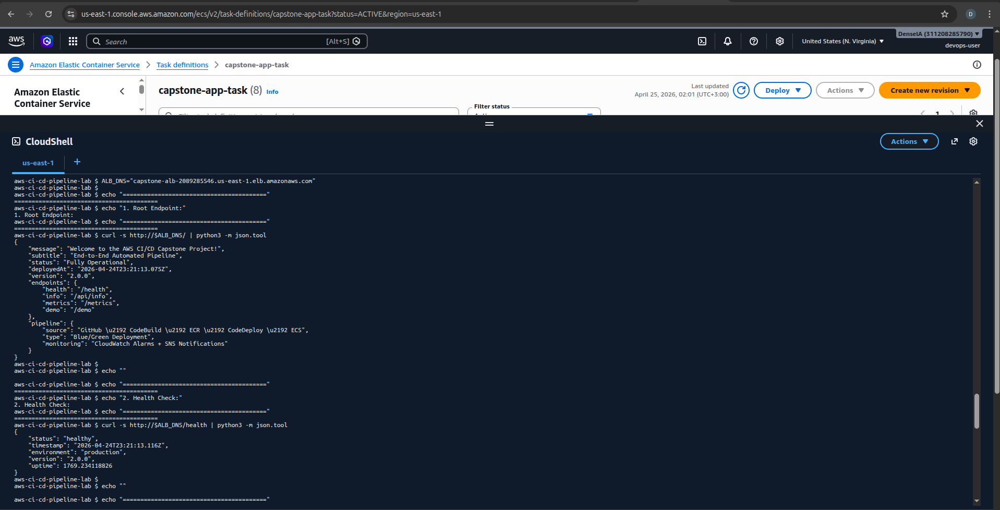
*CLI testing of root and health endpoints*


*Full CLI verification report showing all infrastructure components healthy*

---

## Configuration File Reference

**buildspec.yml** controls what CodeBuild does during the pipeline:

| Phase | What happens |
|---|---|
| pre_build | Logs into ECR using get-login-password, sets the image URI and tag variables |
| build | Installs npm packages in src/, runs Jest tests, builds the Docker image |
| post_build | Pushes both latest and commit-hash tagged images to ECR, writes imagedefinitions.json |
| artifacts | Exports imagedefinitions.json so the Deploy stage knows which image to use |

**appspec.yml** tells CodeDeploy which ECS service and container to update. The TaskDefinition value is replaced automatically by CodePipeline at deploy time.

**taskdef.json** defines the full ECS task including the container image, port mappings, CPU and memory, CloudWatch log group, and health check command. The image placeholder `<IMAGE_NAME>` is replaced by CodePipeline using the imagedefinitions.json from the build stage.

---

## IAM Permissions Reference

| Role | What it needs |
|---|---|
| codebuild-capstone-role | ECR push, S3 read/write, CloudWatch Logs |
| AWSCodeDeployRoleForECS | ECS full access, ELB read/write, S3 read |
| CodePipeline service role | CodeBuild, CodeDeploy, S3, SNS, ECS |
| ecsTaskExecutionRole | ECR pull, CloudWatch Logs write |

---

## Troubleshooting

| Problem | Likely cause | Fix |
|---|---|---|
| Cannot connect to Docker daemon | Privileged mode not enabled | Edit the CodeBuild project and enable Privileged mode |
| ECR login fails | Old get-login command in buildspec | Use get-login-password piped to docker login |
| npm test fails in CodeBuild | Jest path points to wrong folder | Run `npx jest ../tests/ --passWithNoTests` from inside src/ |
| CodeDeploy group missing | ECS service created with rolling update | Delete and recreate the service with Blue/Green deployment type |
| ALB returns 502 | Container not reachable on port 3000 | Check ECS security group allows inbound port 3000 from the ALB security group |
| ECS tasks keep stopping | App crashes on startup | Check CloudWatch Logs at /ecs/capstone-app for the error |
| Health check path error on Windows | Git Bash converts /health to a Windows path | Use //health in CLI commands or run `export MSYS_NO_PATHCONV=1` |
| Pipeline not triggering on push | GitHub connection not authorized | Go to CodePipeline > Settings > Connections and check it is Active |
| Approval email not received | Gmail filters AWS notification emails to spam | Check spam for no-reply@sns.amazonaws.com, or approve directly in the console |


*Every git push to main automatically builds, tests, and deploys the application through the full pipeline.*